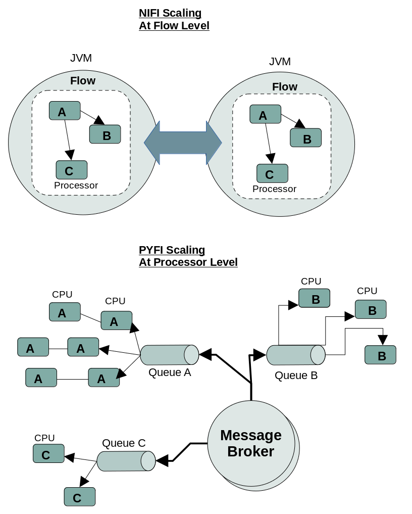
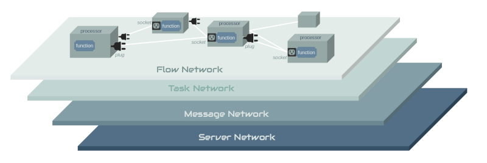
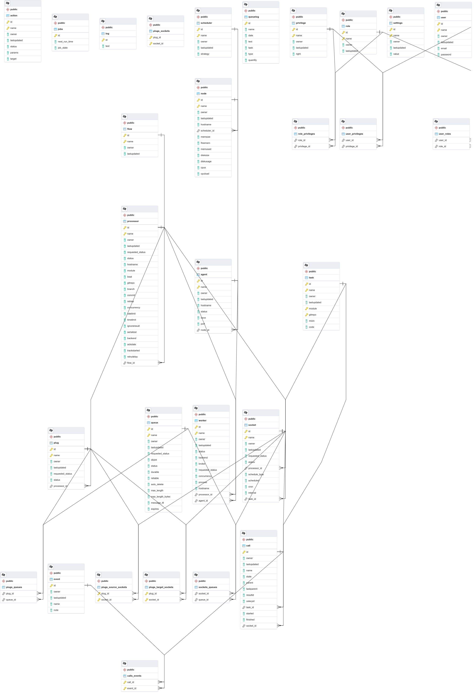

A distributed data flow and computation system that runs on transactional messaging infrastructure. PYFI is designed to operate as a NVM Networked-Virtual-Machine by implementing distributed logic over networked hardware CPU/GPU processors and is suitable for all kinds of computational tasks.

The entire PYFI stack, as a whole, provides a complete "Managed Compute Platform" (MCP) with specialized, best-of-breed tooling to support [different layers](#network-layers) of concern, such as:
* Hardware Compute Resources
* Compute Availability & Scheduling
* Distributed Flows
* Python Processors
  * Modules & Functions
* Data Logging and Streaming
  * Real-time & Historical Metrics
  
With the PYFI compute environment different roles & responsibilities exist:
* Hardware Admins
* Infrastructure Admins
* Compute Admins
* Data Admins
* Code Repository Owners
* End Users

PYFI provides the necessary tooling for all these adminstrators and users to work together smoothly across heterogenous compute environments.

*NOTE: This repo will initially contain the core design documentation for PYFI but eventually I will commit the code here. Currently looking for sponsors to support the effort. If curious or interested, please reach out to me at darren@ontrenet.com.*
## Introduction
PYFI differs from other dataflow engines in that it is fully distributed and runs "at-scale" across heterogeneous infrastructure and computational resources.

It establishes a logical directed-graph (DG) overlay network across compute nodes and executes your custom processor scripts (python, node, bash).

Using the power of reliable, transactional messaging, compute tasks are never lost, discarded or undone. Fault tolerance and load-balancing are intrinsic qualities of PYFI and not tacked on as a separate process, which itself would be a failure point.

### A True Elastic Compute Platform

PYFI provides a set of interacting compute layers that control the location and execution of managed code assets.
With PYFI, code modules and functions can be loaded at multiple locations and invoked from clients without knowledge of where those functions are or how those functions are called.

Redundant code (processors) loaded into a PYFI network will be able to respond to higher volume of data and requests and thus can scale at will, individually.

Functional tasks (processors hosting code) are fronted by durable queues that deliver reliable invocations when those functions are present on the network, regardless of their exact location.
This allows the system to be resilient to hardware or network changes, as well as influence by schedulers that might change the location of functions (processors) to re-balance the resources across the network.

All of this underlying management, hardware arriving and departing, services starting and stopping, processors moving from one host to another (or failing), is completely invisibile to the applications and clients using the system. To them, function calls will always, eventually be executed, if not immediately, in the near future when compute resources allow it.

### Benefits

The PYFI platform provides numerous benefits:

* **A single, purpose-built platform** that addresses end-to-end managed compute from the CPU to the end user. Compared to cobbled together frameworks.
* **Data flow and data streaming support**
* **Real-time observable data** across your compute resources
* **DevOps out-of-the-box** - PYFI integrates directly with GIT allowing your existing code management practices to be used.
* **Elastic, At-Scale** - PYFI is an elastic infrastructure, meaning that it scales up and down on-the-fly. Code can be moved across hardware locations at any time without data loss.
* **Extensible** - PYFI is designed to be extended and specialized to your needs. Both the UI and the core platform is open and leverages modern framework design patterns to easily build on top of.

## Outline

* [Introduction](#introduction)
* [High Level Architecture](#high-level-architecture)
  * [At-Scale Design](#at-scale-design)
* [Tech Stack](#tech-stack)
* [Design Goals](#design-goals)  
* [Detailed Architecture](#detailed-architecture)
  * [Network Layers](#network-layers)
  * [Execution Stack](#execution-stack)
  * [Why A SQL Database?](#why-a-sql-database)
  * [Data Model](#data-model)
  * [Security Model](#security-model)
  * [Logical Processors](#logical-processors)
* [Command Line Interface](#command-line-interface)  
* [System Objects](#system-objects)
  * [Nodes](#nodes)
  * [Agents](#agents)
  * [Processors](#processors)
  * [Workers](#workers)
  * [Tasks](#tasks)
* [Building Dataflows](#building-dataflows)
* [Stack Tools](#stack-tools)

## High-Level Architecture
The following diagram shows one cross-section of the current *reference implementation* of PYFI. Since everything behind the database can be implemented in a variety of ways, this architecture is not absolute.


### At Scale Design

PYFI is designed to operate "at scale", which means there is a one-to-one correspondence between logic compute units (processors) and physical compute units (CPU cores).
This provides a number of obvious and inherent benefits such as hardware redundancy, high-availability, fault-tolerance, fail-over, performance and ease of maintenance.

Below is a diagram that compares the scaling architecture of Apache NIFI to PYFI. Whereas, NIFI uses a course grained, flow-level scaling design, PYFI uses a fine grained, processor-level scale design.



## Tech Stack
The following diagram shows the technology stack for the reference implementation. It uses entirely FOSS software that is mature, open and in most cases supported by a commercial entity.
All of these components provide instant, out-of-the-box functionality that contributes to the PYFI system ensemble and have proven their usefulness in enterprise production settings.

*NOTE: You are not forced to use any of these tools and can use other compatible tools, make your own, or replace the backend component entirely*


## Design Goals

As the name suggests, PYFI is a spiritual offshoot of [Apache NIFI](https://nifi.apache.org/) except built using a python stack for running python (and other scripting languages) processors.
However, PYFI is designed to be more broad in terms of design and scope which we will discuss below.

Some important design goals for this technology are:

1. **Fault-Tolerant** - PYFI runs as a distributed network of logical compute processors that have redundancy and load-balancing built in.
2. **At-Scale** - This phrase is important. It indicates that the logical constructs (e.g. pyfi processors) run at the scale of the hardware (e.g. CPU processors), meaning there is a 1-1 correlation (physical mapping) between hardware processors and pyfi processors.
3. **Secure** - All the functional components in PYFI (database, broker, storage, cache) have security built in.
4. **Dynamic** - The topology and behavior of a PYFI network can be adjusted and administered in real-time without taking down the entire network. Because PYFI is not a single VM controlling everything, you can add/remove update components without negatively impacting the functionality of the system.
5. **Distributed** - As was mentioned above, everything in PYFI is inherently distributed, down to the processors. There is no physical centralization of any kind. 
6. **Performance** - PYFI is built on mature technology stack that is capable of high-throughput message traffic.
7. **Reliability** - The distributed queue paradigm used by PYFI allows for every processor in your dataflow to consume and acknowledge message traffic from its inbound queues and write to outbound queues. These durable queues persist while processors consume messages off them.
8. **Scalability** - Processors can scale across CPUs, Machines and networks, consuming message traffic off the same or multiple persistent queues. In fact, PYFI can auto-scale processors to accommodate the swell of tasks arriving on a queue. In addition, pyfi processors will be automatically balanced across physical locations to evenly distribute computational load and reduce local resource contention.
9. **Pluggable Backends** - PYFI supports various implementations of backend components such as message (e.g. RabbitMQ, SQS) or result storage (SQL, Redis, S3) in addition to allowing you to implement an entire backend (behind the SQL database) yourself.
10. **Real-time Metrics** - PYFI processors will support real-time broadcasting of data throughput metrics via subscription web-sockets. This will allow for all kinds of custom integrations and front-end visualizations to see what the network is doing.
11. **Data Analysis** - One of the big goals for PYFI is to save important data metrics about the flows and usages so it can be mined by predictive AI models later. This will give your organization key insights into the movement patterns of data.
12. **GIT Integration** - All the code used by processors can be pulled from your own git repositories giving you instant integration into existing devops and CM processes. PYFI will let you select which repo and commit version you want a processor to execute code from in your flows.

## Detailed Architecture
PFYI is a scalable, high-performance network architecture that separates concerns across layers. Each layer has best-of-breed components that manage the responsibility of that layer.
The slides below show the different layers and their responsibilities, starting with the bottom-most layer.

### Managed Compute

PYFI takes a different approach to staging and executing python code on its network. Other frameworks or libraries allow you to define your functions in your execution environment and serialize that code to remote workers for execution. Obviously that has some serious security implications in a *shared, managed compute environment*. So PYFI does not allow this. Rather, you request PYFI to mount your code through a secure git repostiory URL. This becomes *the contract* between you and PYFI and allows PYFI to securely load your code into its network.

This approach also allows administrators to control white and blacklists for what repositories of code it trusts.

#### Code Isolation

Each PYFI worker that mounts a git repository, will create a virtual environment for that code and execute the repositories *setup.py* to install the code in that virtual environment. This is beneficial for a number of reasons, but most importantly it keeps the environment for the mounted code separate from the PYFI agent's python environment.
### Network Layers

PYFI is a distributed, scalable architecture and as such it is relationship between connected hardware & service layers interacting as a whole.




### Execution Stack
The following diagram shows the traversal of PYFI programs through various stages from the top-level compute API to its destination python function (task).


### Why a SQL Database?
The center of the PYFI architecture is an enterprise-grade transactional database that maintains the relational models used by the PYFI network.

Some of you might be asking why a SQL database is the center abstraction point of PYFI, SQL databases have been around for decades! Let me explain.

There are some important enterprise qualities we want from the logical database that governs the structure and behavior of a PYFI network.

* ***Constraints*** - PYFI data models should adhere to logical constraints that maintain the integrity of the network design. This prevents any errors in the data model that might cause the network to not perform. It also protects against any errors introduced by humans.
* ***Transactions*** - Similar to the nature of the message/task layer, we want to provide transactional semantics to the data layer so sets of logical changes can be applied in an atomic fashion. This ensures your network is not caught in an inconsistent (or partial) state when making design changes.
* ***Security*** - Row level security is built into the database and allows us to control who is able to see what without having to implement a weaker form of this at the application layer. By design, the pyfi stack captures access control semantics ***all the way down to the data**.* 
* ***Scaling*** - SQL databases such as Postgres have mature scaling mechanics that allow them to cluster and scale appropriately.
* ***Administration*** - Mature tools exist to administer and manage SQL databases that don't need to be reinvented.

Coupling the PYFI physical network from the logical model through a transactional database allows for future implementation-independence of a particular PYFI network.
All the existing PYFI CLI tools that operate on the database will continue to work as is, if you choose to implement a different backend.

### Data Model

The data model is the system abstraction behind which the PYFI reference implementation operates. Services monitor the data models and reflect the semantics of the data in the PYFI network state.

For example, if a processor model *requested_status* is changed to "STOPPED" then the agent responsible for that processor will stop the processor and put its *status* field to "STOPPED".

Simply put, the PYFI network "reacts" to the current state of the database.



### Security Model

PYFI uses a fine grained access control model for user actions against the data model (via UI or CLI or API). At the database level this is also enforced with RLS (Row Level Security) features of Postgres (or your database of choice).
It is vital to the security model of PYFI to implement access control all the way through the stack down to the row data.

Using the CLI you can add and remove privileges for individual users and view their current privileges.

```python
$ pyfi add privilege --user darren --name DELETE

# You can only add privileges that are named in the list of rights further below. Trying to add something not in this list will result in an error.

$ pyfi ls user --name darren
+--------+--------------------------------------+----------+------------+
|  Name  |                  ID                  |  Owner   |   Email    |
+--------+--------------------------------------+----------+------------+
| darren | a725b5ff-bb60-401a-a79a-7bfcb87dfc93 | postgres | d@some.com |
+--------+--------------------------------------+----------+------------+
Privileges
+--------+--------+----------------------------+----------+
|  Name  | Right  |        Last Updated        |    By    |
+--------+--------+----------------------------+----------+
| darren | CREATE | 2021-08-18 08:59:42.749164 | postgres |
| darren | DELETE | 2021-08-19 08:36:29.922190 | postgres |
+--------+--------+----------------------------+----------+
```

Here is an initial list of the privileges ("rights") that can be assigned to a user.

```python

rights = [  'ALL',
            'CREATE',
            'READ',
            'UPDATE',
            'DELETE',

            'DB_DROP',
            'DB_INIT',

            'START_AGENT',

            'RUN_TASK',
            'CANCEL_TASK',

            'UPDATE_PROCESSOR',
            'DELETE_PROCESSOR',
            'START_PROCESSOR',
            'STOP_PROCESSOR',
            'PAUSE_PROCESSOR',
            'RESUME_PROCESSOR',
            'LOCK_PROCESSOR',
            'UNLOCK_PROCESSOR',
            'VIEW_PROCESSOR',
            'VIEW_PROCESSOR_CONFIG',
            'VIEW_PROCESSOR_CODE',
            'EDIT_PROCESSOR_CONFIG',
            'EDIT_PROCESSOR_CODE'

            'LS_PROCESSORS',
            'LS_USERS',
            'LS_USER',
            'LS_PLUGS',
            'LS_SOCKETS',
            'LS_QUEUES',
            'LS_AGENTS',
            'LS_NODES',
            'LS_SCHEDULERS',
            'LS_WORKERS',

            'ADD_PROCESSOR',
            'ADD_AGENT',
            'ADD_NODE',
            'ADD_PLUG',
            'ADD_PRIVILEGE',
            'ADD_QUEUE',
            'ADD_ROLE',
            'ADD_SCHEDULER',
            'ADD_SOCKET',
            'ADD_USER',

            'UPDATE_PROCESSOR',
            'UPDATE_AGENT',
            'UPDATE_NODE',
            'UPDATE_PLUG',
            'UPDATE_PRIVILEGE',
            'UPDATE_QUEUE',
            'UPDATE_ROLE',
            'UPDATE_SCHEDULER',
            'UPDATE_SOCKET',
            'UPDATE_USER',

            'DELETE_PROCESSOR',
            'DELETE_AGENT',
            'DELETE_NODE',
            'DELETE_PLUG',
            'DELETE_PRIVILEGE',
            'DELETE_QUEUE',
            'DELETE_ROLE',
            'DELETE_SCHEDULER',
            'DELETE_SOCKET',
            'DELETE_USER',

            'READ_PROCESSOR',
            'READ_AGENT',
            'READ_NODE',
            'READ_PLUG',
            'READ_PRIVILEGE',
            'READ_QUEUE',
            'READ_ROLE',
            'READ_SCHEDULER',
            'READ_SOCKET',
            'READ_USER'
            ]
```

### Logical Processors

PYFI implements the notion of a *logical processor* that acts as a one-to-one proxy to physical hardware processor cores. PYFI processors have a few interesting traits, only a handful of which are listed below.
* **Reliable** - Messages (or method calls) on PYFI processors are durable and reliable, surviving faults, reboots or restarts.
* **Load Balanced** - PYFI processors run natively as a cluster of distributed processes that automatically balanced invocation load.
* **High Availability** - For the same reasons PYFI processors are reliable and durable, they also become highly-available
* **Hardware Independent** - PYFI processors are hardware independent and also server independent. They can be relocated from one server to another at any time, even while they are running, without data loss.

Because of the logical nature of PYFI processors, PYFI can offer the user a truly scalable and elastic compute paradigm with powerful visual tools.

#### Introduction to Processors & Sockets

PYFI processors reference python modules that are stored in specific git repositories. When PYFI launches a processor, that git repository is loaded into an isolated virtualenv for that processor.
Individual functions within that module are referenced by *sockets* that are attached to the processor.

The socket is the logical abstraction of an inbound task invocation, a durable queue and a python function. Client code or other processors can send data to specific processor sockets which are then dispatched to the associated python function and the result is either returned or forwarded to the next socket attached in the data flow (which is to say putting the request on its queue).

#### ***Processors & Sockets Using the GUI***


#### ***Processors & Sockets Using the CLI***

```bash
pyfi add queue -n pyfi.queue1 -t direct
pyfi add processor -n proc1 -g https://github.com/radiantone/pyfi-processors -m pyfi.processors.sample 
pyfi add socket -n proc1.socket1 -q pyfi.queue1 -pn proc1 -t do_something
pyfi add socket -n proc1.socket2 -q pyfi.queue1 -pn proc1 -t do_this
```
#### ***Processors & Sockets Using the API***

```python
from pyfi.client.api import Processor, Socket, Queue

# Create a processor
processor = Processor(name='proc1', module='pyfi.processors.sample', branch='main',
                      gitrepo='https://github.com/radiantone/pyfi-processors')

# Create a socket for that processor
do_something = Socket(name='proc1.socket1', processor=processor, queue={
                'name': 'pyfi.queue1'}, task='do_something')

do_this = Socket(name='proc1.socket2', processor=processor, queue={
    'name': 'pyfi.queue1'}, task='do_this')

# Send a message to a socket
do_something("Hello World !")

do_this("Do this!!")
```

#### Parallel Compute & Workflow API 
This example builds on top of the previous client API built into PYFI and let's you define a simple and flexible API based on your processor functions, so it looks like *plain-old-python*. A key goal with this API is that the design of the workflow (which is to say its structure) should be *obvious* just by looking at the code.

We also introduce parallel workflow constructs such as *pipeline*, *parallel* and *funnel* here but will talk about them in more detail later on.


NOTE: The functions *do_something* and *do_this* are actual (but contrived) python functions connected to a Processor via git repository. Merely used for examples.
View them [here](https://github.com/radiantone/pyfi-processors/blob/main/pyfi/processors/sample.py).
```python
""" Example"""
from pyfi.client.api import parallel, pipeline, funnel

# Function API over your processor models
from pyfi.client.example.api import do_something_p as do_something, do_this_p as do_this

# Durable, reliable, parallel, distributed workflows
_pipeline = pipeline([
    do_something("One"),
    do_something("Two"),
    parallel([
        do_something("Four"),
        do_something("Five"),
    ]),
    do_something("Three")])

_parallel = parallel([
    _pipeline,
    do_something("Two"),
    do_something("Three")])

_funnel = funnel([
    do_something("One"),
    _parallel,
    do_this("Three")])

print("FUNNEL: ", _funnel(do_this("Four")).get())

```
## Command Line Interface

One of the design goals for PYFI was to allow both Graphical and Command line User Interfaces. A CLI will open up access to various server-side automations, devops pipelines and human sysops that can interact with the PYFI network through a remote console.

All constructs within PYFI can be created, deleted, updated or otherwise managed via the CLI as well as the GUI, again, adhering to the principle that architecture is logically designed and loosely coupled in ways that enable more freedom and technology independence if desired.

Here is a sample script that builds a distributed flow using just the CLI

```bash

pyfi add node -n node1 -h phoenix
pyfi add node -n node2 -h radiant 
pyfi add node -n node3 -h miko
pyfi add scheduler --name sched1

pyfi scheduler -n sched1  add --node node1
pyfi scheduler -n sched1  add --node node2
pyfi scheduler -n sched1  add --node node3

pyfi add processor -n proc1 -g https://github.com/radiantone/pyfi-processors -m pyfi.processors.sample -t do_something
pyfi add queue -n pyfi.queue1 -t direct
pyfi add queue -n pyfi.queue2 -t direct
pyfi add queue -n pyfi.queue3 -t direct

pyfi add outlet -n proc1.outlet1 -q pyfi.queue1 -pn proc1
pyfi add plug -n plug1 -q pyfi.queue2 -pn proc1
pyfi add plug -n plug3 -q pyfi.queue3 -pn proc1
pyfi add processor -n proc2 -g https://github.com/radiantone/pyfi-processors -m pyfi.processors.sample -t do_this -h radiant
pyfi add outlet -n proc2.outlet1 -q pyfi.queue2 -pn proc2

pyfi add processor -n proc4 -g https://github.com/radiantone/pyfi-processors -m pyfi.processors.sample -t do_something -h radiant
pyfi add outlet -n proc4.outlet1 -q pyfi.queue1 -pn proc4

pyfi add processor -n proc3 -g https://github.com/radiantone/pyfi-processors -m pyfi.processors.sample -t do_this -h miko
pyfi add outlet -n proc3.outlet1 -q pyfi.queue3 -pn proc3

```

Here are some sample help screens from the CLI.

**Top level pyfi help screen**

```bash
$ pyfi
Usage: pyfi [OPTIONS] COMMAND [ARGS]...

  PYFI CLI for managing the pyfi network

Options:
  --debug         Debug switch
  -d, --db TEXT   Database URI
  -i, --ini TEXT  PYFI .ini configuration file
  -c, --config    Configure pyfi
  --help          Show this message and exit.

Commands:
  add        Add an object to the database
  agent      Run pyfi agent
  api        API server admin
  db         Database operations
  delete     Delete an object from the database
  ls         List database objects
  node       Node management operations
  proc       Run or manage processors
  scheduler  Scheduler management commands
  task       PYFI task management
  update     Update a database object
  web        Web server admin
```
**Adding various objects to the PYFI network database**
```bash
$ pyfi add
Usage: pyfi add [OPTIONS] COMMAND [ARGS]...

  Add an object to the database

Options:
  --id TEXT  ID of object being added
  --help     Show this message and exit.

Commands:
  agent      Add agent object to the database
  node       Add node object to the database
  outlet     Add outlet to a processor
  plug       Add plug to a processor
  processor  Add processor to the database
  queue      Add queue object to the database
  role       Add role object to the database
  scheduler  Add scheduler object to the database
  user       Add user object to the database
```

**Running & managing distributed processors**
```bash
$ pyfi proc
Usage: pyfi proc [OPTIONS] COMMAND [ARGS]...

  Run or manage processors

Options:
  --id TEXT  ID of processor
  --help     Show this message and exit.

Commands:
  pause    Pause a processor
  remove   Remove a processor
  restart  Start a processor
  resume   Pause a processor
  start    Start a processor
  stop     Stop a processor
```

**Listing objects in the database**
```bash
$ pyfi ls
Usage: pyfi ls [OPTIONS] COMMAND [ARGS]...

  List database objects

Options:
  --help  Show this message and exit.

Commands:
  agents      List agents
  nodes       List queues
  outlets     List outlets
  plugs       List agents
  processors  List processors
  queues      List queues
  schedulers  List queues
  users       List users
  workers     List workers
```
### Advanced UI

PYFI uses a custom built, modern User Interface derived from the core design of NIFI but extended in meaningful ways. You can preview the PYFI UI in the [pyfi-ui](https://github.com/radiantone/pyfi-ui) repository.

**Real Time Streaming Analytics**


**Real Time Coding**


**Advanced Workflows with Embedded Subflows**


## Stack Tools

The follow section shows screenshots of the tech stack UI tools. PYFI uses best-of-breed components in its stack and does not try to reinvent the wheel or tackle all the needs itself (being average in all of them).

### pgAdmin

pgadmin is the UI for postgres.


### Portainer

Manage your docker container stack


### Redis Insights

Manage your cache and task results datastore


### RabbitMQ Admin UI

Manage your message broker and queues


### Flower

Manage your task queues


### Kibana

Build dashboards from your logs and long-term persistence


### Amplify

Monitor your network reverse proxy (NGINX)

