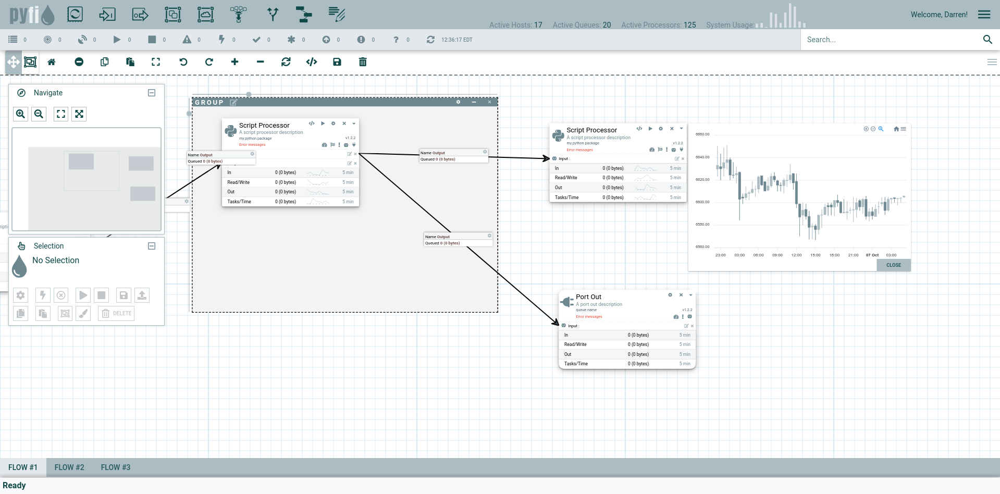

A distributed data flow and computation system that runs on transactional messaging infrastructure.

*NOTE: This repo will initially contain the core design documentation for PYFI but eventually I will commit the code here. Currently looking for sponsors to support the effort. If curious or interested, please reach out to me at darren@ontrenet.com.*
## Introduction
PYFI differs from other dataflow engines in that it is fully distributed and runs "at-scale" across heterogeneous infrastructure and computational resources.

It establishes a logical directed-acyclic-graph (DAG) overlay network across compute nodes and executes your custom processor scripts (python, node, bash).

Using the power of reliable, transactional messaging, compute tasks are never lost, discarded or undone. Fault tolerance and load-balancing are intrinsic qualities of PYFI and not tacked on as a separate process, which itself would be a failure point.

## High-Level Architecture


## Design Goals

As the name suggests, PYFI is a spiritual offshoot of [Apache NIFI](https://nifi.apache.org/) except built using a python stack for running python (and other scripting languages) processors.
However, PYFI is designed to be more broad in terms of design and scope which we will discuss below.

Some important design goals for this technology are:

1. **Fault-Tolerant** - PYFI runs as a distributed network of logical compute processors that have redundancy and load-balancing built in.
2. **At-Scale** - This phrase is important. It indicates that the logical constructs (e.g. pyfi processors) run at the scale of the hardware (e.g. CPU processors), meaning there is a 1-1 correlation (physical mapping) between hardware processors and pyfi processors.
3. **Secure** - All the functional components in PYFI (database, broker, storage, cache) have security built in.
4. **Dynamic** - The topology and behavior of a PYFI network can be adjusted and administered in real-time without taking down the entire network. Because PYFI is not a single VM controlling everything, you can add/remove update components without negatively impacting the functionality of the system.
5. **Distributed** - As was mentioned above, everything in PYFI is inherently distributed, down to the processors. There is no physical centralization of any kind. 
6. **Performance** - PYFI is built on mature technology stack that is capable of high-throughput message traffic.
7. **Reliability** - The distributed queue paradigm used by PYFI allows for every processor in your dataflow to consume and acknowledge message traffic from its inbound queues and write to outbound queues. These durable queues persist while processors consume messages off them.
8. **Scalability** - Processors can scale across CPUs, Machines and networks, consuming message traffic off the same or multiple persistent queues. In fact, PYFI can auto-scale processors to accommodate the swell of tasks arriving on a queue. In addition, pyfi processors will be automatically balanced across physical locations to evenly distribute computational load and reduce local resource contention.
9. **Pluggable Backends** - PYFI supports various implementations of backend components such as message (e.g. RabbitMQ, SQS) or result storage (SQL, Redis, S3) in addition to allowing you to implement an entire backend (behind the SQL database) yourself.
10. **Real-time Metrics** - PYFI processors will support real-time broadcasting of data throughput metrics via subscription web-sockets. This will allow for all kinds of custom integrations and front-end visualizations to see what the network is doing.
11. **Data Analysis** - One of the big goals for PYFI is to save important data metrics about the flows and usages so it can be mined by perdictive AI models later. This will give your organization key insights into the movement patterns of data.
12. **GIT Integration** - All the code used by processors can be pulled from your own git repositories giving you instant integration into existing devops and CM processes. PYFI will let you select which repo and commit version you want a processor to execute code from in your flows.

## Detailed Architecture

### Why a SQL Database?
Some of you might be asking why a SQL database is the center abstraction point of PYFI, SQL databases have been around for decades! Let me explain.

There are some important enterprise qualities we want from the logical database that governs the structure and behavior of a PYFI network.

* ***Constraints*** - PYFI data models should adhere to logical constraints that maintain the integrity of the network design. This prevents any errors in the data model that might cause the network to not perform.
* ***Transactions*** - Similar to the nature of the message/task layer, we want to provide transactional semantics to the data layer so sets of logical changes can be applied in an atomic fashion - enforcing constraints as well.
* ***Security*** - Row level security is built into the database and allows us to control who is able to see what without having to implement a weaker form of this at the application layer
* ***Scaling*** - SQL databases such as Postgres have mature scaling mechanics that allow them to cluster and scale appropriately.
* ***Administration*** - Mature tools exist to administer and manage SQL databases that don't need to be reinvented

Coupling the PYFI physical network from the logical model through a transactional databases allows for future implementation-independence of a particular PYFI network.
All the existing PYFI CLI tools that operate on the database will continue to work as is, if you choose to implement a different backend.

### Command Line Control

One of the design goals for PYFI was to allow both Graphical and Command line User Interfaces. A CLI will open up access to various server-side automations, devops pipelines and human sysops that can interact with the PYFI network through a remote console.

All constructs within PYFI can be created, deleted, updated or otherwise managed via the CLI as well as the GUI, again, adhering to the principle that architecture is logically designed and loosely coupled in ways that enable more freedom and technology independence if desired.

Here is a sample script that builds a distributed flow using just the CLI

```bash

pyfi add node -n node1 -h phoenix
pyfi add node -n node2 -h radiant 
pyfi add node -n node3 -h miko
pyfi add scheduler --name sched1

pyfi scheduler -n sched1  add --node node1
pyfi scheduler -n sched1  add --node node2
pyfi scheduler -n sched1  add --node node3

pyfi add processor -n proc1 -g https://github.com/radiantone/pyfi-processors -m pyfi.processors.sample -t do_something
pyfi add queue -n pyfi.queue1 -t direct
pyfi add queue -n pyfi.queue2 -t direct
pyfi add queue -n pyfi.queue3 -t direct

pyfi add outlet -n proc1.outlet1 -q pyfi.queue1 -pn proc1
pyfi add plug -n plug1 -q pyfi.queue2 -pn proc1
pyfi add plug -n plug3 -q pyfi.queue3 -pn proc1
pyfi add processor -n proc2 -g https://github.com/radiantone/pyfi-processors -m pyfi.processors.sample -t do_this -h radiant
pyfi add outlet -n proc2.outlet1 -q pyfi.queue2 -pn proc2

pyfi add processor -n proc4 -g https://github.com/radiantone/pyfi-processors -m pyfi.processors.sample -t do_something -h radiant
pyfi add outlet -n proc4.outlet1 -q pyfi.queue1 -pn proc4

pyfi add processor -n proc3 -g https://github.com/radiantone/pyfi-processors -m pyfi.processors.sample -t do_this -h miko
pyfi add outlet -n proc3.outlet1 -q pyfi.queue3 -pn proc3

```

Here are some sample help screens from the CLI.

**Top level pyfi help screen**

```bash
$ pyfi
Usage: pyfi [OPTIONS] COMMAND [ARGS]...

  Pyfi CLI for managing the pyfi network

Options:
  --debug         Debug switch
  -d, --db TEXT   Database URI
  -i, --ini TEXT  PYFI .ini configuration file
  -c, --config    Configure pyfi
  --help          Show this message and exit.

Commands:
  add        Add an object to the database
  agent      Run pyfi agent
  api        API server admin
  db         Database operations
  delete     Delete an object from the database
  ls         List database objects
  node       Node management operations
  proc       Run or manage processors
  scheduler  Scheduler management commands
  task       Pyfi task management
  update     Update a database object
  web        Web server admin
```
**Adding various objects to the PYFI network database**
```bash
$ pyfi add
Usage: pyfi add [OPTIONS] COMMAND [ARGS]...

  Add an object to the database

Options:
  --id TEXT  ID of object being added
  --help     Show this message and exit.

Commands:
  agent      Add agent object to the database
  node       Add node object to the database
  outlet     Add outlet to a processor
  plug       Add plug to a processor
  processor  Add processor to the database
  queue      Add queue object to the database
  role       Add role object to the database
  scheduler  Add scheduler object to the database
  user       Add user object to the database
```

**Running & managing distributed processors**
```bash
$ pyfi proc
Usage: pyfi proc [OPTIONS] COMMAND [ARGS]...

  Run or manage processors

Options:
  --id TEXT  ID of processor
  --help     Show this message and exit.

Commands:
  pause    Pause a processor
  remove   Remove a processor
  restart  Start a processor
  resume   Pause a processor
  start    Start a processor
  stop     Stop a processor
```

**Listing objects in the database**
```bash
$ pyfi ls
Usage: pyfi ls [OPTIONS] COMMAND [ARGS]...

  List database objects

Options:
  --help  Show this message and exit.

Commands:
  agents      List agents
  nodes       List queues
  outlets     List outlets
  plugs       List agents
  processors  List processors
  queues      List queues
  schedulers  List queues
  users       List users
  workers     List workers
```
### Advanced UI

PYFI uses a custom built, modern User Interface derived from the core design of NIFI but extended in meaningful ways. You can preview the PYFI UI in the [pyfi-ui](https://github.com/radiantone/pyfi-ui) repository.

**Real Time Streaming Analytics**


**Real Time Coding**


**Advanced Workflows with Embedded Subflows**


## Outline

*Under Construction*

* [Overview](#overview)
* [Design Goals](#design-goals)  
* [Architecture](#architecture)
  * [Models](#models)
    * [Nodes](#nodes)
    * [Agents](#agents)
    * [Processors](#processors)
    * [Workers](#workers)
    * [Tasks](#tasks)
* [CLI](#cli)  
* [Building Dataflows](#building-dataflows)

