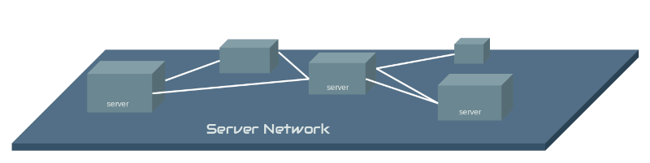
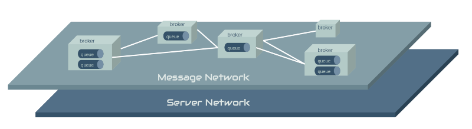
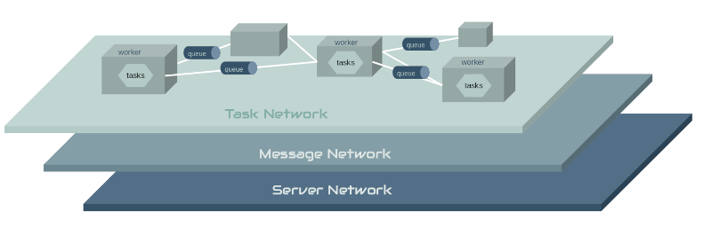

Architecture
================================
.. toctree::
   :maxdepth: 2

ElasticCode is a scalable, high-performance network architecture that separates concerns across layers. Each layer has best-of-breed components that manage the responsibility of that layer.
The slides below show the different layers and their responsibilities, starting with the bottom-most layer.

Managed Compute
---------------

ElasticCode takes a different approach to staging and executing python code on its network. Other frameworks or libraries allow you to define your functions in your execution environment and serialize that code to remote workers for execution. Obviously that has some serious security implications in a *shared, managed compute environment*. So ElasticCode does not allow this. Rather, you request ElasticCode to mount your code through a secure git repostiory URL. This becomes *the contract* between you and ElasticCode and allows ElasticCode to securely load your code into its network.

This approach also allows administrators to control white and blacklists for what repositories of code it trusts.

Code Isolation
--------------

Each ElasticCode worker that mounts a git repository, will create a virtual environment for that code and execute the repositories *setup.py* to install the code in that virtual environment. This is beneficial for a number of reasons, but most importantly it keeps the environment for the mounted code separate from the ElasticCode agent's python environment.

Layered Design
--------------

ElasticCode is a distributed, scalable architecture and as such it is relationship between connected hardware & service layers interacting as a whole.

.. image:: ../../screens/layer4.png
   :align: center